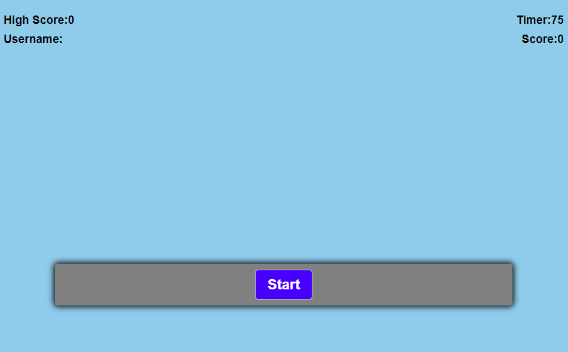
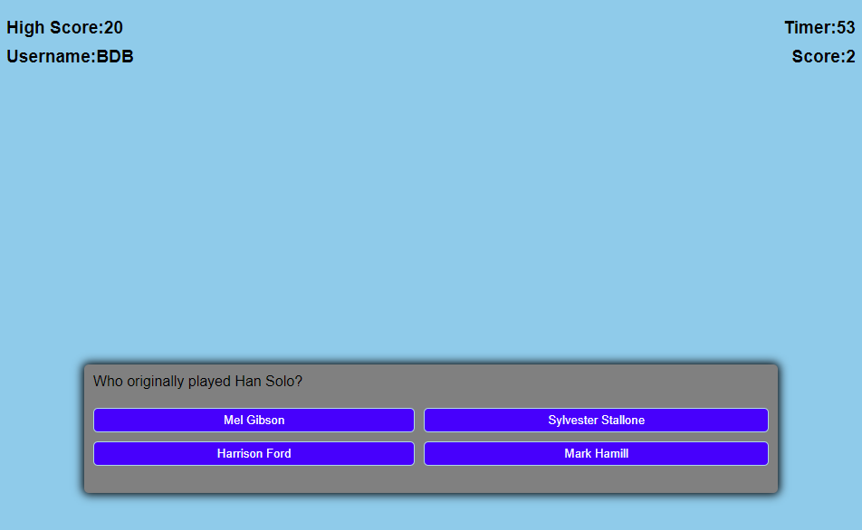
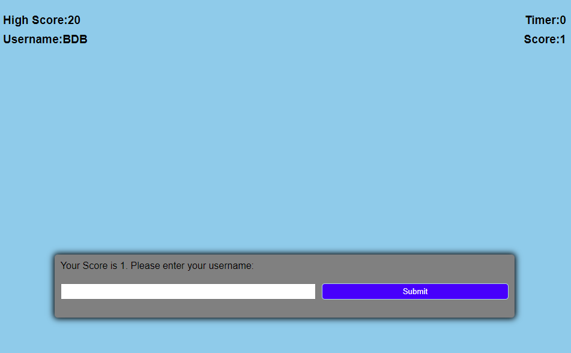

# Code Quiz (Homework - 4)

Root folder contains:

* README.md      (Read Me File)
* index.html     (Code Quiz Page)
* \Assets\       (CSS and Images Folder)
*   \JS\        (Folder that hold the javascript.js file)
*   \CSS\       (Folder that holds CSS)
*   \Sound\     (Folder that holds the sound files)

## Description
This is a Star Wars quiz. You will be provided a time limit to answer the questions. Each wrong answer will result in 0 points added and a lose of 5 seconds. Each correct answer will provide 1 point. For every 5 seconds left after completing the quiz, the user is granted and extra point. High score will be displayed in the top left corner of the site.

## Usage
* Site starts out showing a High Score of 0 and a blank username.
* Provides a timer at 75 seconds and a score to track users current progress through the quiz.

* Once Start button is pressed, the timer will begin to count down and the user will be presented with the first question (random question).
* 4 Buttons appear and the user will be asked a question and need to select one of the 4 buttons to provide an answer.

* Correct answer will add one to the score.
* Wrong answer will remove "5" seconds.

* Once the time runs out or the user answers every question the user is given their score and is asked to enter their username.
* If there is remaining time on the clock, seconds will be divided by 10 and rounded down then added to the users score.
* If users score is better (higher) than the current high score, then the user will replace the high score with their score and username.

## Extra Features
* Timer will turn red after it has lost 5 seconds to give a better visual to the user
* "Victory" sound plays when correct answer is selected
* "Wrong" sound plays when incorrect answer is selected

## Visuals
<a href="https://bbrintle.github.io/4-Code-Quiz/">Visit Site</a>
 

## Resources Used
Javascript
 
HTML/CSS

## Authors
This was created by Blake Brintle. 
 
blakebrintle@gmail.com
 
<a href="https://bbrintle.github.io/">Blake's Site</a>

## License
* MIT

- - -